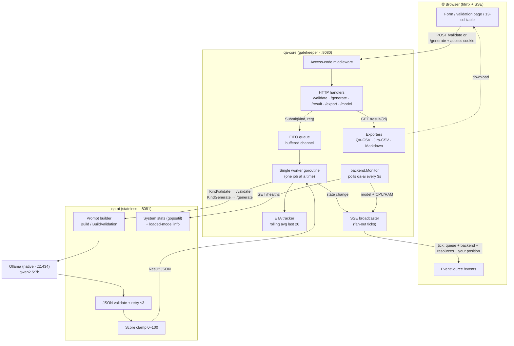
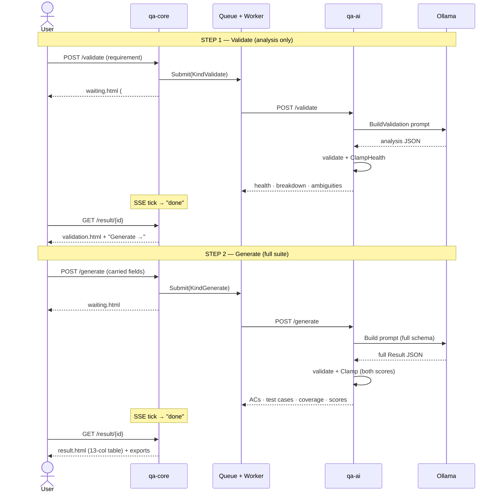

# Architecture & Orchestration

How the orchestrator works as of **v1.3** (two-step validate → generate flow).
GitHub renders the Mermaid diagrams below inline; PNG/SVG copies live in
[`docs/img/`](./img).

- **`qa-core`** — the gatekeeper (`:8080`): access gate, the FIFO queue + single
  worker, ETA tracker, SSE broadcaster, exports, and the UI.
- **`qa-ai`** — stateless generator (`:8081`): builds the prompt, calls Ollama,
  validates the JSON (≤3 retries), and clamps the scores.
- **Ollama** — native on the host (`:11434`), serving `qwen2.5:7b`.

---

## 1. Architecture & data flow

---

## 2. The two-step flow (sequence)

---

## Key orchestration facts

- **One queue, two job kinds** (`KindValidate` / `KindGenerate`) — both serialize
  through the *same single worker*, so the one-at-a-time guarantee holds across
  the two-step flow. A validate and a generate never run concurrently.
- **qa-ai is stateless** — it doesn't track step 1 vs step 2. qa-core decides the
  job kind; qa-ai just picks `Build` (full schema) vs `BuildValidation` (analysis
  only).
- **Two separate LLM calls** per full run (validate, then generate). This makes
  each step independent — and splits the model's output budget, so the suite is
  leaner than the old single-shot generation.
- **SSE is independent of the work.** The broadcaster fans out queue position +
  backend model state + CPU/RAM to *every* connected browser on each state change,
  so live status needs no polling and no refresh.
- **Exports are pure transforms** over the canonical `Result` JSON in qa-core —
  the 13-col table view and the QA CSV come from the same `QARepositoryRows`.
